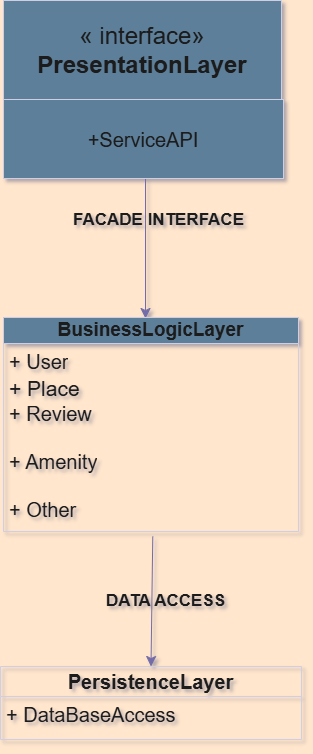
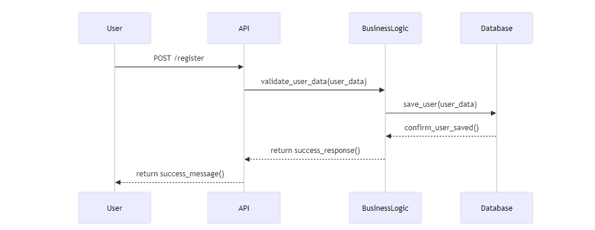
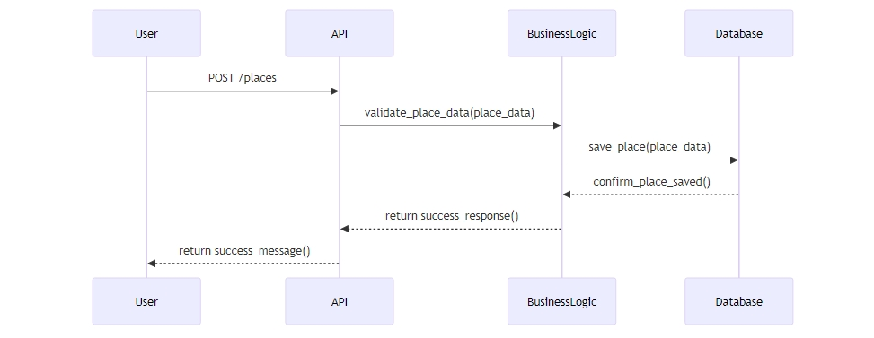
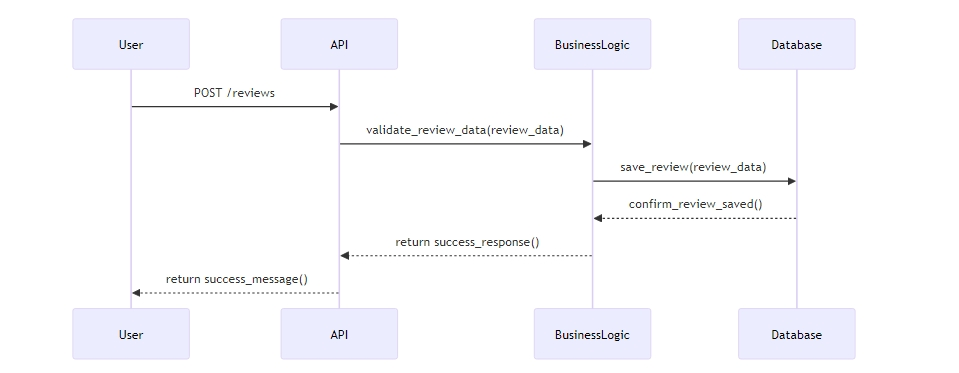
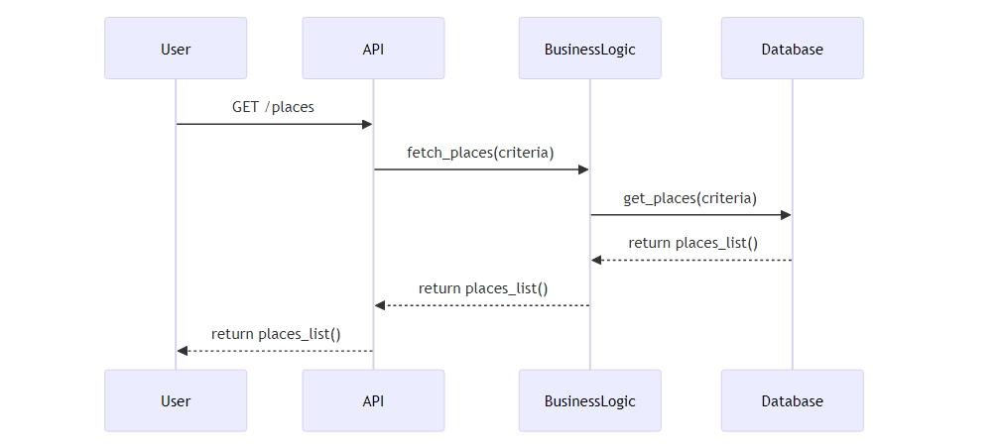

# Technical Document for the HBnB Project

## 1. Introduction

This technical document presents the architecture and design of the HBnB project, a housing reservation platform. It compiles the necessary diagrams and explanatory notes to guide the implementation phases. This document serves as a reference for understanding the interaction between the different layers of the application, as well as the data flows associated with API calls.

## 2. High-Level Architecture

### High-Level Package Diagram

### Explanation:

The diagram above illustrates the layered architecture of the HBnB application. The application is divided into three main layers:
- **Presentation Layer**: Manages user interaction, including API services.
- **Business Logic Layer**: Contains business rules and system logic, managed by various models.
- **Persistence Layer**: Handles data access and interaction with the database.

The Facade pattern is used to simplify interaction between these layers, allowing for smooth communication.

## 3. Business Logic Layer

### Detailed Class Diagram

### Explanation:

The class diagram above shows the main entities of the business logic layer for the HBnB application. The entities include:

- **User**: Represents a user of the system. Key attributes: `uuid`, `email`, `password`, `created_at`, `updated_at`. Methods: `register()`, `login()`.
  
- **Place**: Represents a place available for reservation. Key attributes: `uuid`, `name`, `description`, `price`, `user_id`, `created_at`, `updated_at`. Methods: `create()`, `update()`, `delete()`.
  
- **Review**: Represents a review left by a user for a place. Key attributes: `uuid`, `rating`, `comment`, `place_id`, `user_id`, `created_at`, `updated_at`. Methods: `submit()`, `delete()`.
  
- **Amenity**: Represents amenities available in a place. Key attributes: `uuid`, `name`, `place_id`. Methods: `add()`, `remove()`.

The relationships between the entities are also indicated, illustrating how they interact with each other to form the application logic.

## 4. API Interaction Flow

### Sequence Diagrams for API Calls

#### a. User Registration

### Explanation:

The diagram above shows the user registration process. The steps include:
1. **User** makes an API call to register.
2. **API** processes the request and communicates with the **Business Logic**.
3. **Business Logic** validates and stores the data in the **Database**.
4. The **Database** confirms the registration and returns a response to the **API**.
5. The **API** returns the result to the **User**.

This flow of interactions ensures that registration is managed correctly and users receive prompt feedback on their requests.

#### b. Place Creation

### Explanation:

The diagram shows how a user creates a new place:
1. **User** sends a place creation request through the **API**.
2. **API** forwards the request to the **Business Logic**.
3. **Business Logic** saves the place in the **Database**.
4. Confirmation of creation is sent back to the **API**, which communicates it to the **User**.

This process ensures that users can easily add places to the platform.

#### c. Review Submission

### Explanation:

This diagram shows the process of submitting a review by a user:
1. **User** submits a review through the **API**.
2. **API** sends the details to the **Business Logic**.
3. The **Business Logic** saves the review in the **Database**.
4. The confirmation is sent back to the **API**, which informs the **User**.

This sequence ensures that reviews are processed and stored correctly.

#### d. Fetching a List of Places

### Explanation:

The diagram illustrates the process of retrieving a list of places:
1. **User** makes a request through the **API** to fetch places based on certain criteria.
2. **API** queries the **Business Logic** for the data.
3. **Business Logic** queries the **Database** to retrieve the list.
4. The **Database** returns the results to the **Business Logic**, which sends them to the **API**.
5. Finally, the **API** provides the list to the **User**.

This flow allows users to easily access a list of places matching their search criteria.

---

## Conclusion

This technical document should now be well-structured and ready to serve as a reference throughout the development of the HBnB application. If you have any questions about a particular section or want to dive deeper into a specific aspect, feel free to let me know!

